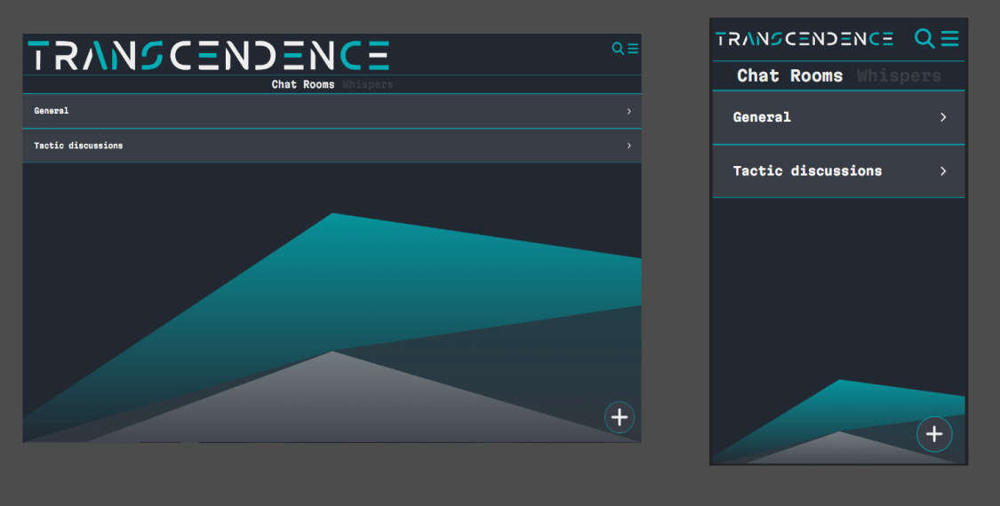

# ft_transcendence
Single Page Application Website. This is the last project of 42 School common core. 
This project is a website that includes a multiplayer pong game.

## Launch the project locally
### Clone the repository
```bash
git clone git@github.com:Bima42/ft_transcendence.git

cd ft_transcendence
```

### Setting up environment variables
- Rename `.env.example` to `.env`
- Change the values of the variables `FORTYTWO_API_UID` and `FORTYTWO_API_SECRET` in `.env` to match your environment
- You should also configure `JWT_KEY` 

### Run containers
- Use `--build` to rebuild images
- Use `--force-recreate` to force recreate image and containers
- Use `-d` to run containers in background

```bash
docker compose up -d
```

### Reach the website
- Go to `https://localhost:4443`

## Documentation
- ### [Summary](docs/Summary.md)
- ### [Docker](docs/docker/0-what-is-docker.md)
- ### [Docker Commands](docs/docker/3-docker-usefull-commands.md)
- ### [Backend](docs/backend/0-what-is-nestjs.md)

## Website overview
### Login

<p align="center">
    
</p>

### Home
<p align="center">
    
</p>

### Profile
<p align="center">
    
</p>

### Chat
<p align="center">
    
</p>

#### Chat with a friend
<p align="center">
    
</p>

### Game
<p align="center">
    
</p>

#### In game
<p align="center">
    
</p>

### Leaderboard
<p align="center">
    
</p>
