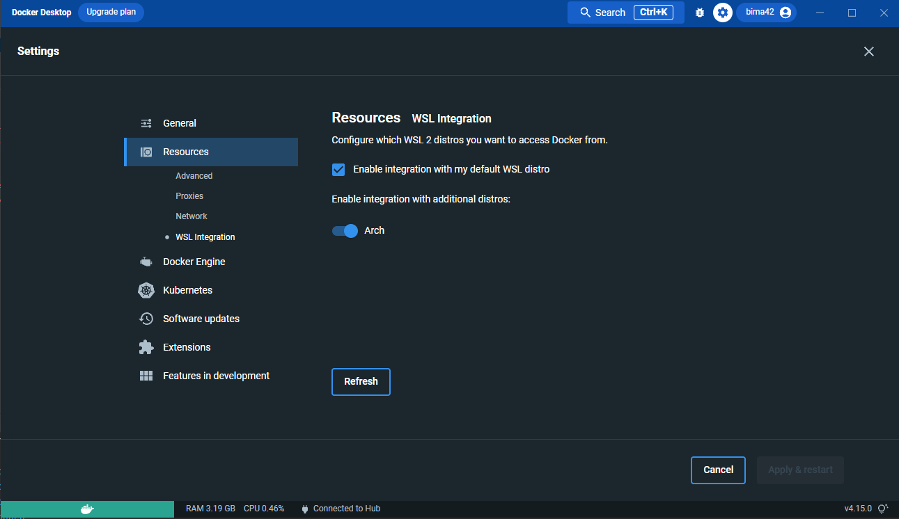

  

***

# Index
***
- ### [1. Install Docker](#install-docker)
  - ##### [1.1 WSL](#wsl)
    - [1.1.1 WSL Steps](#wsl-steps)
    - [1.1.2 Docker Desktop Tweaks](#docker-desktop-tweaks)
    - [1.1.3 Problems when installing](#problems-when-installing)
  - ##### [1.2 Mac](#mac)
    - [1.1.1 Steps](#mac-steps)
    - [1.1.2 Preferences](#preferences)
  - ##### [1.3 Linux](#linux)
    - [1.3.1 Requirements](#requirements)
    - [1.3.2 Linux Docker Desktop Tweaks](#linux-docker-desktop-tweaks)
    - [1.3.3 Problem Credential store not initialised](#problem-credential-store-not-initialised)
- ### [2. Sources](#sources)
- ### [3. Docker Compose](2-docker-compose.md)
### [Back to summary](../Summary.md)

# Install Docker
***

- We recommand you to use Docker Desktop, which is a really good tools to manage your docker containers
- It provides a lot of great features to make docker easier
- For Windows/WSL and Mac, Docker will run a tiny VM inside your host machine to run Docker inside

## WSL
***

- Go to the [docs to download Docker Desktop](https://docs.docker.com/desktop/windows/wsl/#download)

### WSL Steps
***
- Accept this box
  - [ ] Use WSL2 instead of HyperV
- Agree CGV
- May need a reboot for updating Linux kernel
- Will appear an additionnal set up
- Finish this set up and its done

### Docker Desktop Tweaks
***
- Can login to [DockerHub](http://hub.docker.com) for pulls images
- Go Task Bar -> Right Click on Docker -> Settings
  - Go to Resources
  - WSL Integration : accept this
    - [ ] Enable integration with my default WSL distro
  - Plus, in this menu you have to enable Docker for each subsystem you want

  

### Problems when installing
***
##### An unexpected error occured
- Failed to deploy distro docker-desktop
- This happen when you never run virtualisation inside your Windows
- Need BIOS exetensions enabled
- Had to enable virtualisation

## Mac
***
- Go to [docs to install Docker Desktop for Mac](https://docs.docker.com/desktop/install/mac-install/)

### Mac Steps
***
- Choose the right .dmg file according to your MacOS Version
- Launch the APP
- Accept CGU

### Preferences
***
- All Preferences and Settings are in top right of the screen : Click on the Whale Icon to go in
- You can log on [DockerHub](https://hub.docker.com) to pulls images from the hub
- Go to `Preferences` -> `Resources` -> We can adjust the CPU usage, RAM or Disk usage for advanced using
  - Even if we put 8GO RAM, and Docker dont use it, it wont use it
- Go to `Experimental Features`
  - [ ] Enable VirtioFS : grants speed of file transfer between the machine and containers

## Linux
***

- #### This tuto may not work on all Linux Distribution

### Requirements
***
- There is some requirements for installing on Linux

~~~bash
sudo apt-get install ca-certificates curl gnupg lsb-release
~~~

- Each distro is different on Linux
- According to the distro, go to [Docs](https://docs.docker.com/desktop/linux/install/) and follow steps ...

### Linux Docker Desktop Tweaks
***
- You may want to login on [DockerHub](https://hub.docker.com) to pulls images

- Go to `Preferences` -> `Resources` -> `Advanced`
  - Allow you to manage some resources allowed to Docker (CPU, RAM, Disk ...)
- Go to `Preferences` -> `Resources` -> `Sharing`
  - Care on the path able to share with Docker containers. You want that your source code is inside those path to not get error later
    ad-warning
    

### Problem Credential store not initialised
***
- This error can occur after launching Docker Desktop
- Have to generate GPG Keys, always tuto on dockers docs ...

# Sources
***
- <a href="https://docs.docker.com/desktop/windows/wsl/" target="_blank">Install WSL Docs</a>
- <a href="https://docs.docker.com/desktop/install/mac-install/" target="_blank">Install Mac Docs</a>
- <a href="https://docs.docker.com/desktop/install/linux-install/" target="_blank">Install Linux Docs</a>

### [Back to summary](../Summary.md)