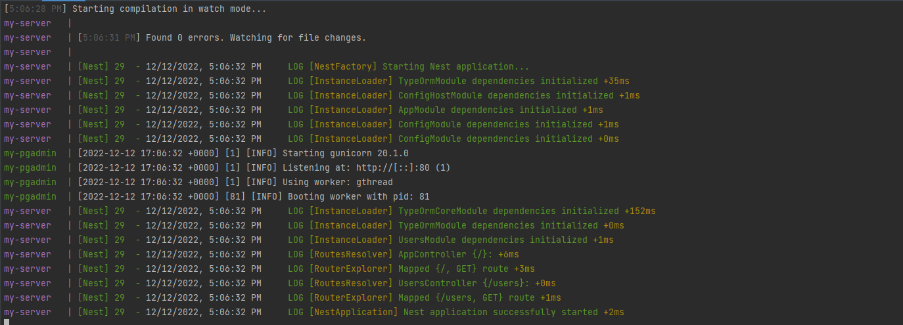

<p align="center">
  <a href="http://nestjs.com/" target="blank"></a>
</p>

[circleci-image]: https://img.shields.io/circleci/build/github/nestjs/nest/master?token=abc123def456
[circleci-url]: https://circleci.com/gh/nestjs/nest

  <p align="center">A progressive <a href="http://nodejs.org" target="_blank">Node.js</a> framework for building efficient and scalable server-side applications.</p>
    <p align="center">
<a href="https://www.npmjs.com/~nestjscore" target="_blank"></a>
<a href="https://www.npmjs.com/~nestjscore" target="_blank"></a>
<a href="https://www.npmjs.com/~nestjscore" target="_blank"></a>
<a href="https://circleci.com/gh/nestjs/nest" target="_blank"></a>
<a href="https://coveralls.io/github/nestjs/nest?branch=master" target="_blank"></a>
<a href="https://discord.gg/G7Qnnhy" target="_blank"></a>
<a href="https://opencollective.com/nest#backer" target="_blank"></a>
<a href="https://opencollective.com/nest#sponsor" target="_blank"></a>
  <a href="https://paypal.me/kamilmysliwiec" target="_blank"></a>
    <a href="https://opencollective.com/nest#sponsor"  target="_blank"></a>
  <a href="https://twitter.com/nestframework" target="_blank"></a>
</p>

***
# Index
***
- ### [1. Disclaimer](#disclaimer)
- ### [2. Getting Started](#getting-started)
- ### [3. Prerequisites](#prerequisites)
- ### [4. Configure database connection](#configure-database-connection)
- ### [5. Create Users table](#create-users-table)
  - ##### [5.1 Entity for Users](#entity-for-users)
  - ##### [5.2 Module for Users](#module-for-users)
  - ##### [5.3 Service for Users](#service-for-users)
  - ##### [5.4 Controller for Users](#controller-for-users)
- ### [6. Adding data to our table user](#adding-data-to-our-table-user)

# Disclaimer
***
- Keep in mind that sometimes, changes may not appear
- Before panicking, try to stop your containers and run the project
~~~bash
docker compose down

docker system prune
~~~

- You may want to remove volumes for any reason
~~~bash
docker volume rm $(docker volume ls -q)
~~~

- Restart project
~~~bash
docker compose up --build
~~~

# Getting Started
***
- You must have a nest project set correctly
- You can go to our [Tutorial for dockerize nest and postgres](2-dockerize-nest-postgres-and-pgadmin)

# Prerequisites
***
- Go to your `backend` folder
- Install TypeORM and Postgres module
~~~bash
npm install --save @nestjs/typeorm typeorm pg
~~~

- Install `Config` module
~~~bash
npm i --save @nestjs/config
~~~

- Add `Users` module
~~~bash
nest g module users
nest g controller users --no-spec
nest g service users --no-spec
~~~

- Launch the project
~~~bash
docker compose up --build
~~~

- You should see something like that
<p align="center">
  
</p>

# Configure database connection
***
- Go to your `src/app.module.ts` file
- We will use Config Module to configure dynamically the database connection
~~~typescript
import { Module } from '@nestjs/common';
import { AppController } from './app.controller';
import { AppService } from './app.service';
import { TypeOrmModule } from '@nestjs/typeorm';
import { UsersModule } from './users/users.module';
import { ConfigModule, ConfigService } from '@nestjs/config';

@Module({
  imports: [
    ConfigModule.forRoot({
      envFilePath: [`../.env`],
    }),
    TypeOrmModule.forRootAsync({
      imports: [ConfigModule],
      inject: [ConfigService],
      useFactory: async (configService: ConfigService) => {
        return {
          type: 'postgres',
          host: configService.get('POSTGRES_HOST'),
          port: configService.get('POSTGRES_PORT'),
          username: configService.get('POSTGRES_USER'),
          password: configService.get('POSTGRES_PASSWORD'),
          database: configService.get('POSTGRES_DB'),
          autoLoadEntities: true,
          synchronize: true,
        };
      },
    }),
    UsersModule,
  ],
  controllers: [AppController],
  providers: [AppService],
})
export class AppModule {}
~~~

# Create Users table
***
## Entity for Users
- In TypeORM, an entity is a class that maps to a database table (or collection when using MongoDB)
- Create a file `src/users/user.entity.ts` and add this code :
```typescript
import { Column, Entity, PrimaryGeneratedColumn } from 'typeorm';

@Entity()
export class User {
  @PrimaryGeneratedColumn()
  id: number;

  @Column()
  firstName: string;

  @Column()
  lastName: string;

  @Column({ default: true })
  isActive: boolean;
}
```

## Module for Users
- TypeORM supports the repository design pattern, so each entity has its own repository
- These repositories can be obtained from the database connection.
- We need to let TypeORM know about it by inserting it into the array in the module `forFeature()` method argument and import it in the users module `src/users/users.module.ts`
```typescript
import { Module } from '@nestjs/common';
import { UsersController } from './users.controller';
import { UsersService } from './users.service';
import { TypeOrmModule } from '@nestjs/typeorm';
import { User } from './user.entity';

@Module({
  imports: [TypeOrmModule.forFeature([User])],
  controllers: [UsersController],
  providers: [UsersService],
})
export class UsersModule {}
```

## Service for Users
- user module uses the `forFeature()` method to define which repositories are registered in the current scope
- We can inject the `UsersRepository` into the `UsersService` using the `@InjectRepository()` decorator in `src/users/users.service.ts`
```typescript
import { Injectable } from '@nestjs/common';
import { InjectRepository } from '@nestjs/typeorm';
import { Repository } from 'typeorm';
import { User } from './user.entity';

@Injectable()
export class UsersService {
  constructor(
    @InjectRepository(User) private usersRepository: Repository<User>,
  ) {}

  getAllUsers(): Promise<Array<User>> {
    return this.usersRepository.find({});
  }
}
```

## Controller for Users
- Now to expose a GET request handler in our application to get all the users, let's update our users controller `src/users/users.controller.ts`
```typescript
import { Controller, Get } from '@nestjs/common';
import { User } from './user.entity';
import { UsersService } from './users.service';

@Controller('users')
export class UsersController {
  constructor(private usersService: UsersService) {}

  @Get()
  getAllUsers(): Promise<Array<User>> {
    return this.usersService.getAllUsers();
  }
}
```

# Adding data to our table user
***
- Launch the project if it's not running
- Go to `localhost:5050` and log you in pgadmin
- Go to your tables : `Servers` -> `Database name` -> `postgres` -> `Schemas` -> `public` -> `Tables`
- Right click on `user` table and `View/Edit data` -> `All Rows`

<p align="center">
  
</p>

- Go to `localhost:3000/users` and you will see your datas !

### [Back to summary](../Summary.md)